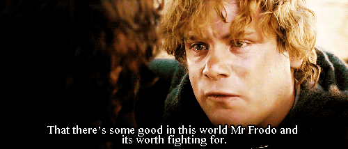

<h1 align="center">👋 Hi there </h1>
<h3 align="center">Data Science Enthusiast | Physics Major | Machine Learning </h3>

---

### 🌐 Connect With Me  

  

<table>
  <tr>
      <td><a href="https://github.com/minturam21"><td>
  
</td>

  </tr>
</table>
---

---
### 💫 About Me  
- 🎓 **Undergraduate in Physics** with a passion for Data Science and AI.  
- 💡 Currently learning **Python, Pandas, NumPy, Matplotlib, Seaborn**, and **Machine Learning**.    
- 🔭 Exploring real-world problem-solving through **data-driven projects**.  
- ⚡ Ambivert who becomes creative around the right people.  

---

### 🧠 Technical Skills  
**Languages & Tools:**  

---

### 🚀 Current Focus  
- 📊 Building projects in **data analysis, visualization, and automation**.  
- 🤖 Starting hands-on **machine learning** mini-projects.  
- 🌐 Designing a **personal portfolio website** (coming soon).  
- 🎯 Preparing for **international internships**.  

---

### 📈 My GitHub Stats  

  

---

### ✨ Quote I Live By  
> “Data doesn’t lie — it reveals.”  
> — and I’m learning to listen to it.  

---

⭐ *“Every small project adds a chapter to my story as a creator, learner, and explorer.”*  
